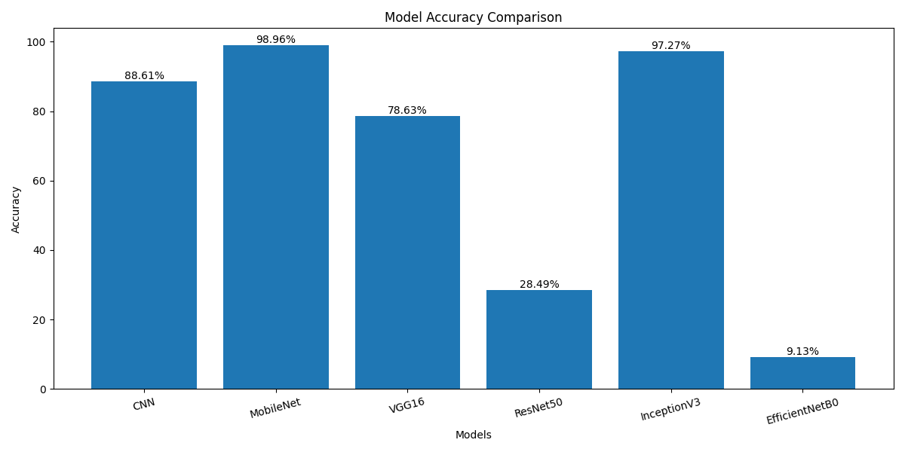
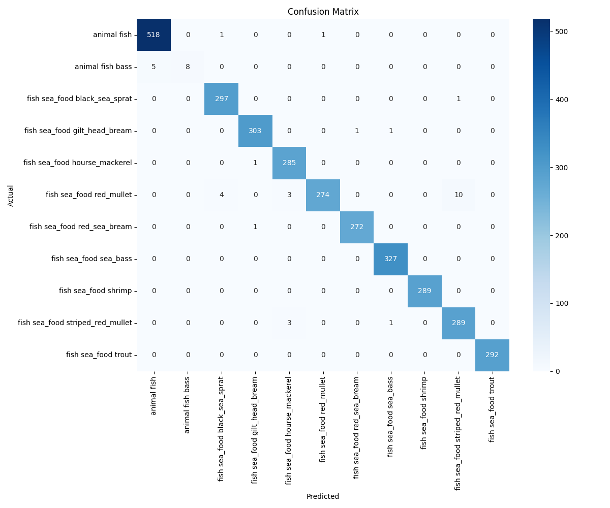

# Multiclass Fish Image Classification

## 📌 Project Overview

This project focuses on classifying fish images into multiple categories using Deep Learning and Transfer Learning techniques.  
A custom CNN model and multiple pretrained models were trained and compared to identify the best-performing architecture.

The final model was deployed using Streamlit for real-time fish image prediction.

---

# 🚀 Features

✅ Multiclass Fish Classification  
✅ CNN Model from Scratch  
✅ Transfer Learning using:
- MobileNet
- VGG16
- ResNet50
- InceptionV3
- EfficientNetB0

✅ Data Augmentation  
✅ Accuracy Comparison  
✅ Confusion Matrix  
✅ Precision, Recall, F1-Score Evaluation  
✅ Streamlit Web Application  
✅ Real-Time Prediction with Confidence Score  

---

# 🧠 Technologies Used

| Technology | Purpose |
|---|---|
| Python | Programming Language |
| TensorFlow/Keras | Deep Learning |
| Streamlit | Web Application |
| NumPy | Numerical Operations |
| Matplotlib | Visualization |
| Seaborn | Confusion Matrix Visualization |
| Scikit-learn | Evaluation Metrics |
| PIL | Image Processing |

---

# 📂 Project Structure

```text
Multiclass-Fish-Classification/
│
├── app/
│   └── app.py
│
├── data/
│   ├── train/
│   ├── val/
│   └── test/
│
├── models/
│   ├── cnn_model.h5
│   ├── mobilenet_model.h5
│   ├── vgg16_model.h5
│   ├── resnet50_model.h5
│   ├── inceptionv3_model.h5
│   └── efficientnetb0_model.h5
│
├── outputs/
│   ├── model_comparison.png
│   └── confusion_matrix.png
│
├── scripts/
│   ├── train.py
│   └── evaluate.py
│
├── best_model.h5
├── requirements.txt
└── README.md
```

---

# 📊 Dataset

The dataset contains multiple fish species categorized into separate folders.

## Dataset Classes

- animal fish
- animal fish bass
- fish sea_food black_sea_sprat
- fish sea_food gilt_head_bream
- fish sea_food hourse_mackerel
- fish sea_food red_mullet
- fish sea_food red_sea_bream
- fish sea_food sea_bass
- fish sea_food shrimp
- fish sea_food striped_red_mullet
- fish sea_food trout

---

# 🔄 Data Preprocessing

The following preprocessing techniques were applied:

- Image Rescaling
- Rotation Augmentation
- Zoom Augmentation
- Horizontal Flipping
- Image Normalization

---

# 🏗️ Models Used

## 1. CNN Model
A custom Convolutional Neural Network was built from scratch.

## 2. Transfer Learning Models

| Model | Accuracy |
|---|---|
| CNN | 88.61% |
| MobileNet | 98.96% |
| VGG16 | 78.63% |
| ResNet50 | 28.49% |
| InceptionV3 | 97.27% |
| EfficientNetB0 | 9.13% |

## 🏆 Best Model
✅ MobileNet — 98.96%

---

# 📈 Model Accuracy Comparison

Add your generated graph image here:

```md

```

---

# 📉 Confusion Matrix

Add your confusion matrix image here:

```md

```

---

# 📋 Classification Report

| Metric | Score |
|---|---|
| Accuracy | 99% |
| Weighted Precision | 99% |
| Weighted Recall | 99% |
| Weighted F1-Score | 99% |

---

# 🖥️ Streamlit Application

The Streamlit application allows users to:

- Upload fish images
- Predict fish category
- View confidence score
- View prediction probabilities

---

# ▶️ How to Run the Project

## 1️⃣ Clone Repository

```bash
git clone YOUR_GITHUB_REPOSITORY_LINK
```

---

## 2️⃣ Create Virtual Environment

```bash
python -m venv venv
```

Activate environment:

### Windows

```bash
venv\Scripts\activate
```

---

## 3️⃣ Install Dependencies

```bash
pip install -r requirements.txt
```

---

## 4️⃣ Train Models

```bash
python scripts/train.py
```

---

## 5️⃣ Evaluate Model

```bash
python scripts/evaluate.py
```

---

## 6️⃣ Run Streamlit Application

```bash
streamlit run app/app.py
```

---

# 📸 Application Screenshots

## Upload Interface

Add screenshot here:

```md

```

---

## Prediction Output

Add screenshot here:

```md

```

---

# 🌐 Deployment

The application can be deployed using Streamlit Community Cloud.

---

# 🔮 Future Enhancements

- Fine-tuning pretrained layers
- More fish species support
- Live camera prediction
- Mobile deployment
- Better UI design

---

# 📌 Conclusion

This project successfully demonstrates multiclass fish image classification using Deep Learning and Transfer Learning techniques.  
Among all models, MobileNet achieved the highest performance with excellent classification accuracy.

The project also includes a deployment-ready Streamlit application for real-time predictions.

---

# 👨‍💻 Author

Dineshkumar

---